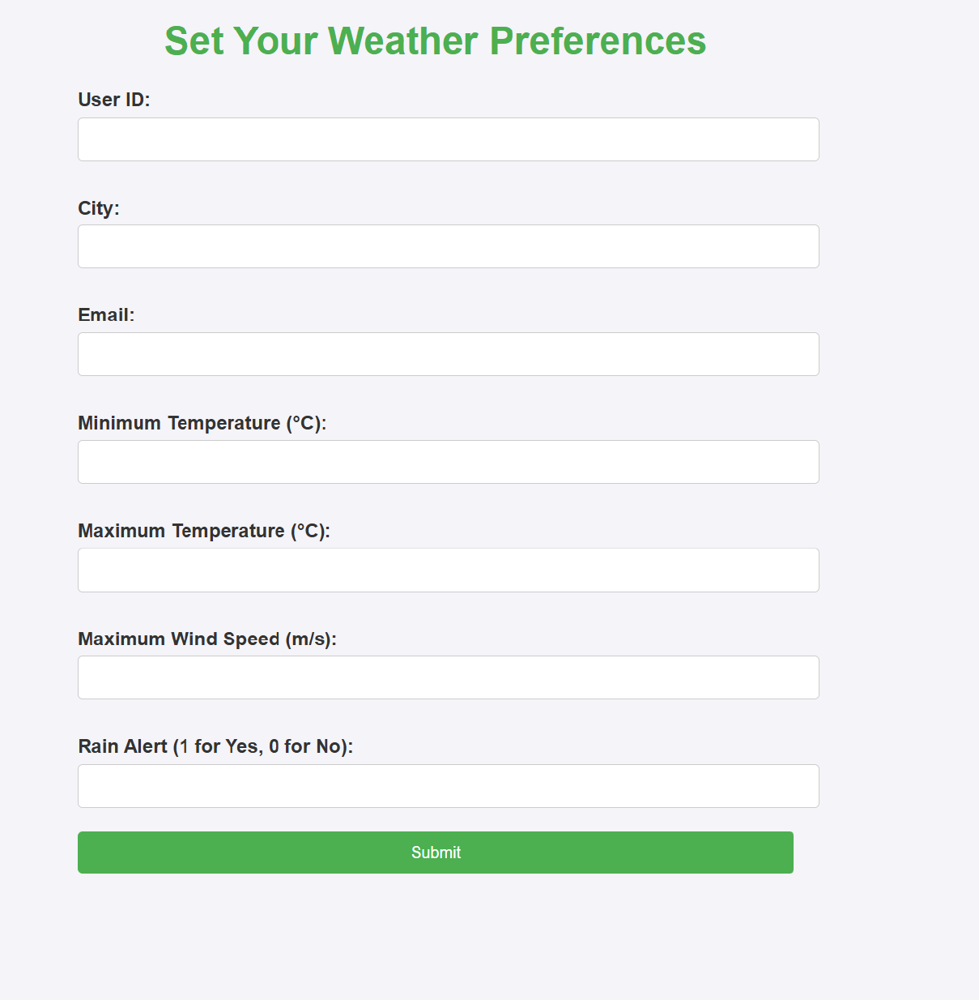
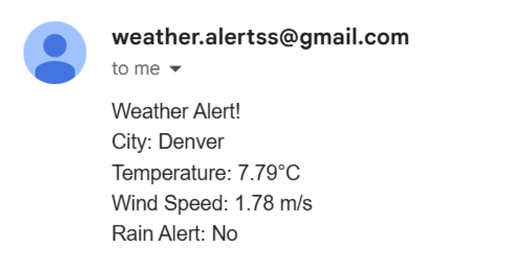

# Weather Alert and Recommendation System
This project is a cloud-based weather notification system that sends personalized weather alerts and recommendations to users based on their preferences. It uses OpenWeather API to fetch real-time weather data and forecasts and integrates them with a Flask application hosted on Google Cloud.

# Team Member:

## Varun Mallela

### The key functionalities include:

- Hourly weather checks to send alerts when conditions match user preferences.
- Daily recommendations for outdoor activities based on the next day's weather forecast based on the set user preferences.
- Dynamic front-end for users to set their preferences and view alerts.

#### The application is fully deployed on Google Cloud and uses the following components:

- Google Compute Engine: To host the Flask application and scripts.
- Google SQL: To store user preferences and weather data.
- Redis: For temporary storage of weather alerts.
- Google Cloud Scheduler: To automate the execution of scripts at scheduled times.

## Prerequisites and Requirements

To get all the files, you can download the zip from GitHub and then upload the app and script files into the VM instance by using SSH or you can use `git clone` to get the files into the VM instance. Specifically, we need `app.py`, the `templates` folder, and the three scripts:

- `daily_weather_recommendations.py`
- `forecast_data_script.py`
- `hourly_weather_alerts.py`

Before setting up the application, ensure the following requirements are met:

### 1. Google Cloud Platform (GCP) Project:
Create a new project in GCP specifically for this application to keep resources organized.

### 2. Compute Instance:
- **Instance Type:** e2-micro
- **Region:** us-central1
- **Operating System:** Ubuntu 20.04 LTS or later

### 3. SQL Database:
- **Database Type:** MySQL
- **MySQL Version:** 8.0
- **Storage Capacity:** 100 GB
- **Region:** us-central1

### 4. MemoryStore Redis:
- **Capacity:** 1 GB
- **Region:** us-central1
- **Private IP:** Private Service Access must be enabled.

### 5. Firewall Rules:
- Redis: Create a firewall rule to allow traffic for TCP:6379.
- Flask: Create a firewall rule to allow traffic for TCP:5000.
- SQL: Ensure the SQL instance is configured to allow public IP access and authorize access to the Compute Engine's external IP.

### 6. OpenWeather API Key:
Register on OpenWeather and generate an API key to fetch weather data.

### 7. SSH Access:
Enable SSH to access the Compute Engine instance for deploying and running the application.

#### First SSH to the VM instance and install Python:
```bash
sudo apt-get install -y python3 python3-pip
```

### 8. Python Environment:
- **Python Version:** 3.8 or later
- **Required Libraries:** Flask, mysql-connector-python, redis, smtplib, requests, email.mime

```bash
pip install flask mysql-connector-python redis requests
```

## Cloud Deployment Setup

### Step 1: Create a VM Instance

1. Navigate to Compute Engine > VM Instances.
2. Click **Create Instance** and configure as follows:
   - **Name:** flask-weather-app
   - **Machine Type:** e2-micro
   - **Region:** us-central1
   - **Operating System:** Ubuntu 20.04 LTS
   - **Disk:** 20 GB standard persistent disk

### Step 2: Set Up SQL Database

1. Navigate to **SQL > Create Instance**.
2. Select MySQL as the database type and configure:
   - **Name:** weather-data
   - **Storage Capacity:** 100 GB
   - **Connections:** Enable Public IP under connections.
3. Create a new database:
   ```sql
   CREATE DATABASE weather_data;
   ```
4. Create required tables:
   ```sql
   USE weather_data;
   CREATE TABLE user_preferences (
       user_id VARCHAR(255) PRIMARY KEY,
       city VARCHAR(255) NOT NULL,
       email VARCHAR(255) NOT NULL,
       temp_min FLOAT NOT NULL,
       temp_max FLOAT NOT NULL,
       wind_max FLOAT NOT NULL,
       rain_alert BOOLEAN NOT NULL
   );
   CREATE TABLE weather_forecast (
       id INT AUTO_INCREMENT PRIMARY KEY,
       city VARCHAR(255),
       forecast_time DATETIME,
       temperature FLOAT,
       humidity INT,
       wind_speed FLOAT,
       weather_condition VARCHAR(255)
   );
   ```

### Step 3: Create Redis Instance

1. Navigate to **MemoryStore > Redis > Create Instance**.
2. Configure the instance as follows:
   - **Name:** weather-redis
   - **Capacity:** 1 GB
   - **Region:** us-central1

### Step 4: Set Up Firewall Rules

Refer to earlier sections for firewall configurations.

### Step 5: Run the Flask Application

1. SSH into the VM instance and navigate to the project folder.
2. Run the Flask app:
   ```bash
   nohup python3 app.py &
   ```

## Cloud Scheduler Setup

### Step 1: Create Jobs

- **Hourly Weather Alerts:** Runs every hour.
- **Daily Weather Forecast:** Runs daily at midnight.
- **Daily Recommendations:** Runs daily at 8:00 AM.

Example Job:
```bash
curl -X POST http://<EXTERNAL_IP>:5000/run_hourly_alerts
```

## Debugging and Testing

### **API Integration Validation**
- Verified OpenWeather API responses using test city names and geolocation checks.
- Debugged API requests by printing URLs, parameters, and responses.
- Logged API request failures and handled exceptions.

### **Database Testing**
- Manually tested MySQL queries.
- Verified Redis caching mechanism for storing and retrieving temporary weather alerts.

### **Email Notification Testing**
- Simulated various weather conditions to ensure correct email alerts were sent.
- Verified email logs and SMTP connection reliability.

### **Unit Testing & End-to-End Testing**
- Conducted unit tests for API calls, database transactions, and email dispatch functions.
- Performed end-to-end tests by setting different user preferences and observing real-time alert generation.

## **System Architecture and Component Interaction**

### **Architecture Diagram**


### **Description of the Interaction Between Components**

1. User Interaction: Users submit preferences (e.g., city, temperature range, rain alerts) via a web interface built with Flask. These preferences are stored in the MySQL database.
2. Weather Data Retrieval: The Flask application uses OpenWeather API to fetch current weather data and 5-day forecasts for user-specified cities.
3. Data Processing:
- MySQL stores user preferences and forecast data for persistence.
- Redis caches weather alerts matching user preferences for temporary use.
4. Automation:
- Google Cloud Scheduler triggers scripts for:
- Refreshing weather forecast data.
- Sending hourly weather alerts based on user preferences.
- Sending daily recommendations for the next day.
5. Email Notifications: Emails are sent using Gmail SMTP to notify users about weather conditions matching their preferences.

## **Future Enhancements**

### **Planned Improvements**
1. **User Experience**
   - Introduce multi-city preference support.
   - Improve UI with Bootstrap.
2. **System Scalability**
   - Optimize API calls by implementing batch requests.
   - Use Docker & Google Cloud Run for scalability.
3. **Advanced Features**
   - Implement SMS alerts using Twilio.
   - Integrate Google Analytics.

## **Screenshots**

- **Flask Web Interface**
  
- **Email Notification Example**
  
- **Google Cloud Scheduler Logs**
  


